# FashionStore - Online Fashion Marketplace

# Team - Group 5

- Nguyễn	Ngọc Bảo Khương - (SE150857)
- Nguyễn Trọng Tín - (SE151117)
- Phan Văn Tiếp Em (SE150335)
- Tôn Thiện Hoàng Hiệp - (SE161662)

## Purpose of the System:
FashionStore is an advanced online marketplace that facilitates the buying and selling of fashionable clothing items for both men and women. The system aims to provide a user-friendly platform for customers to discover and purchase clothing items, while also offering sellers the opportunity to showcase and sell their products to a wider audience.

Users of the System:

### 1. Customers: Individuals interested in purchasing fashionable clothing items online. 

### 2. Admin: Fashion designers or clothing brands looking to showcase and sell their products.

## System Features:
The features are categorized based on the user roles.

### Customer-Related Features:

#### *1. User Registration and Authentication:

New customers can create accounts using a username and password.
Existing customers can securely log in to their accounts.

#### *2. Browsing and Shopping:

Customers can explore a diverse catalog of clothing items for men and women.
Advanced search functionality for finding products by keywords, categories, brands, and more.
Detailed product pages with images, descriptions, prices, and available sizes.
Ability to add products to the shopping cart.

#### *3. Shopping Cart:

Customers can view their cart contents, adjust quantities, and remove items.

#### *4. Order History:

Access to order history and details of past orders.

### Admin-related features:

#### *1. Login and verify the Admin:

Fashion designers and brands can apply to become Admin.
Verification process to ensure Admin authenticity.

#### *2. Product management:

Admin can list their clothing items with pictures, descriptions, prices, and sizes.
Manage inventory and product availability.
Update or deactivate the list as needed.

#### *3. Admin Dashboard and manage order:

Admin has access to a personalized dashboard to manage order history.

## SiteMap

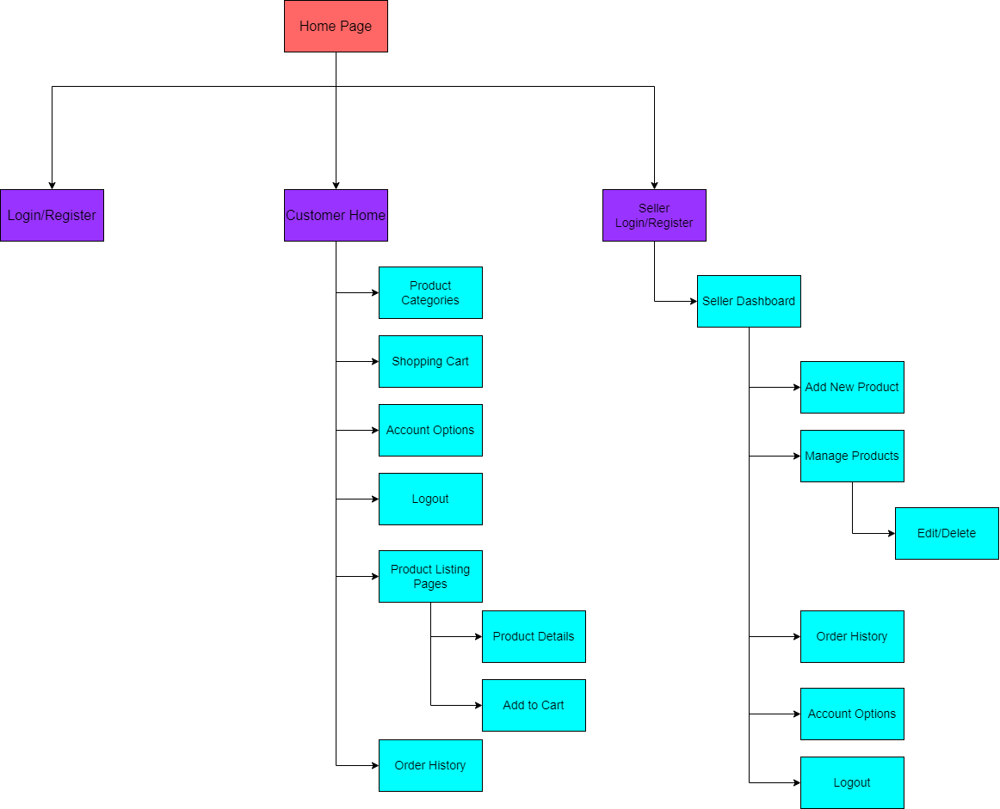

## WireFrame (Gui)

### Role Customer: 

### Login Page

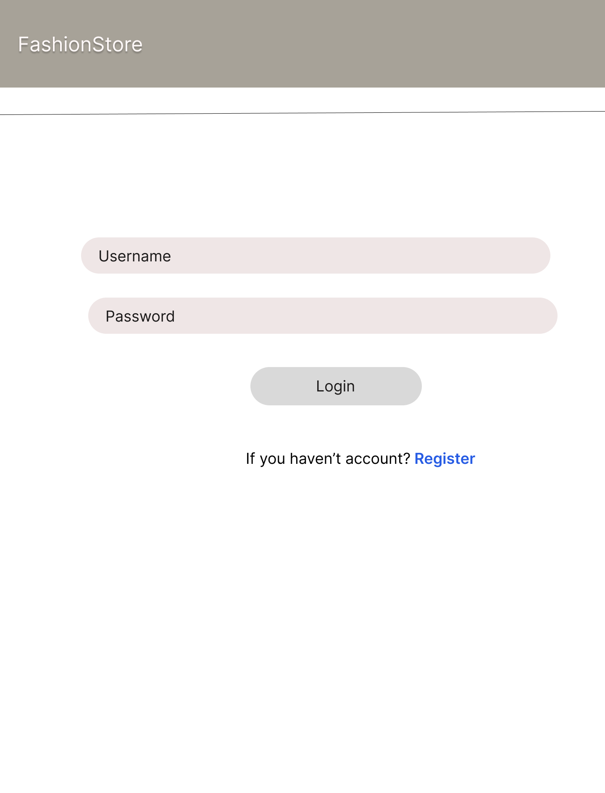

### Register Page

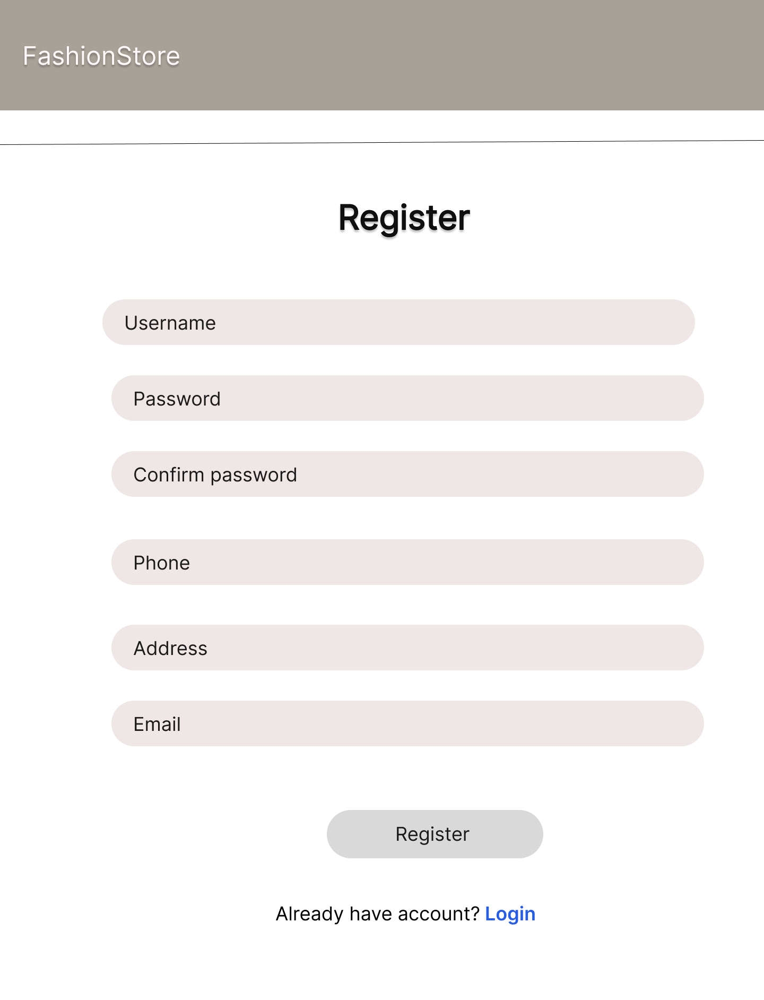

### Home Page (Not Login)

.png)

### Home Page

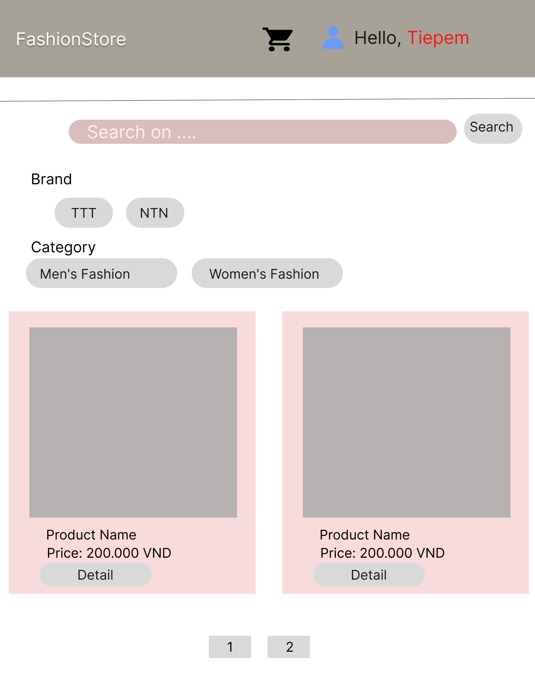

### Detail Product Page

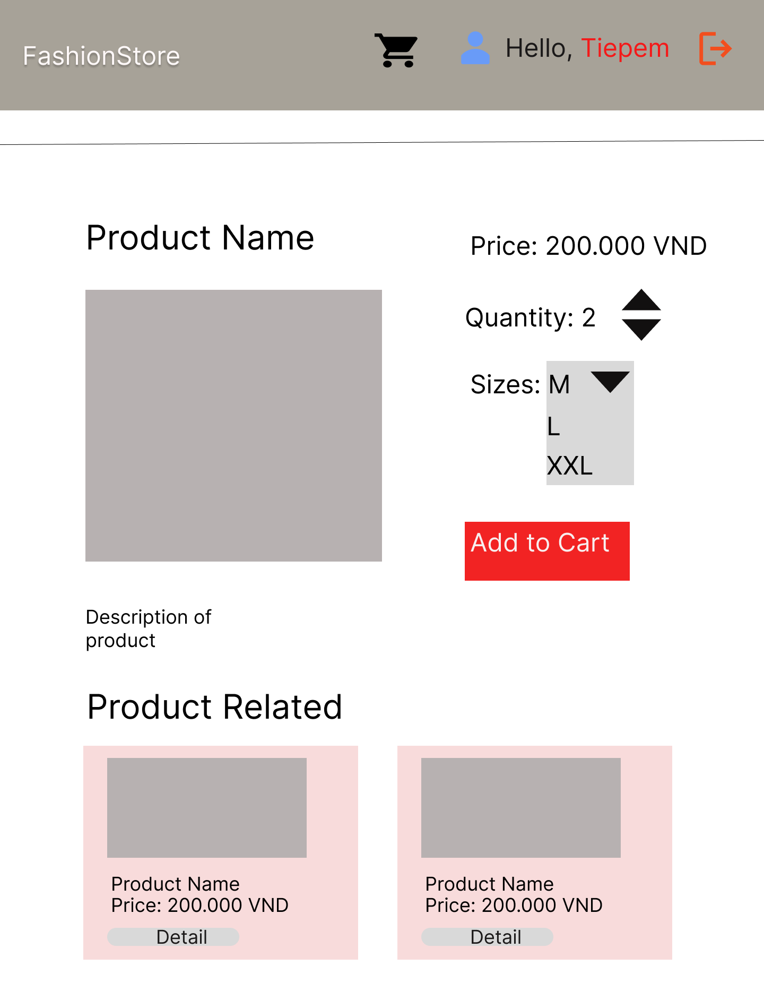

### Cart Page

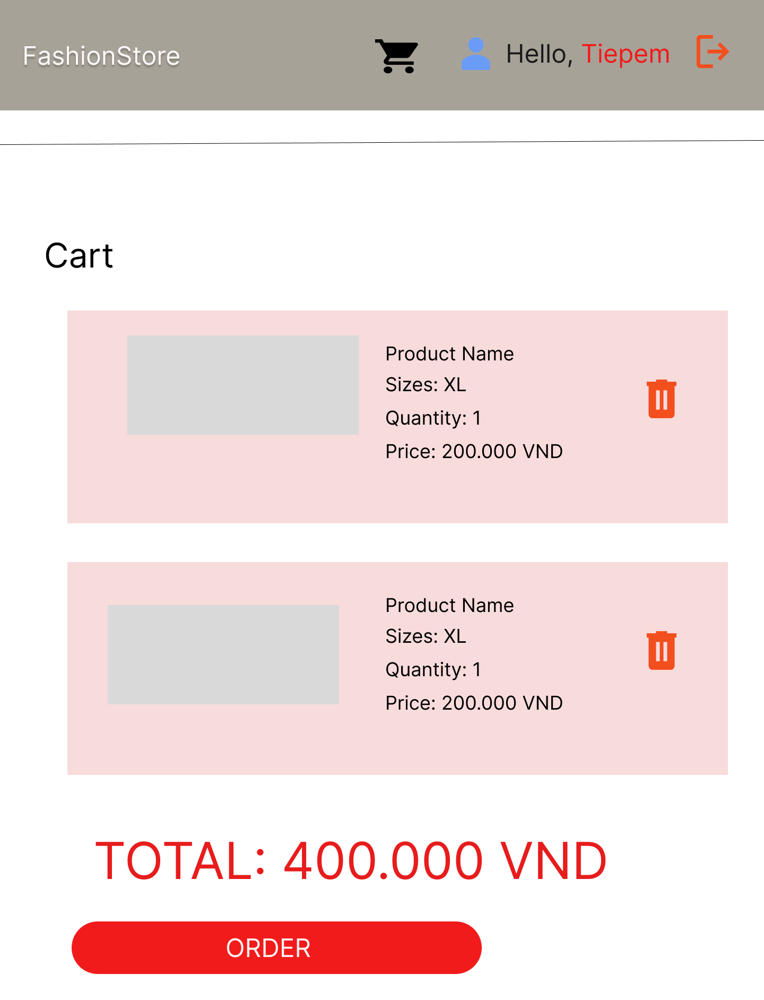

### Profile Page

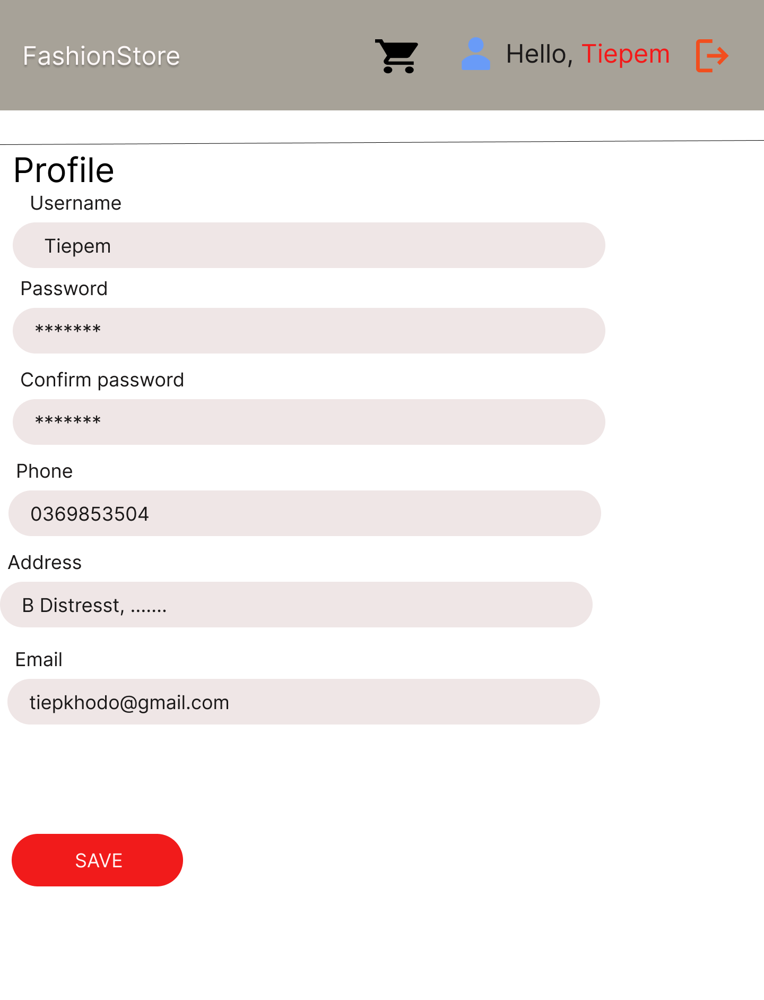

### OrderHistory Page

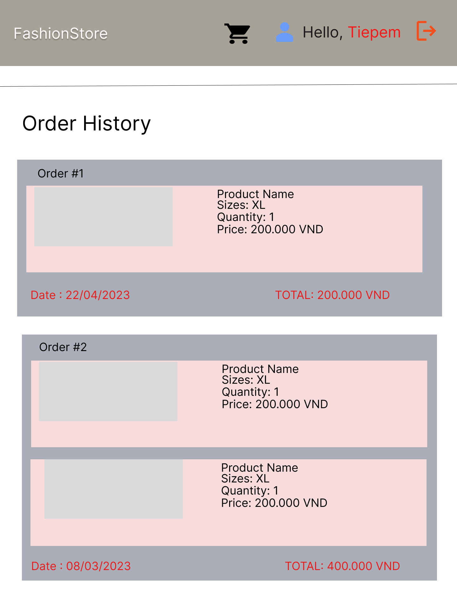

### Role Admin: 

### Admin DashBoard Page

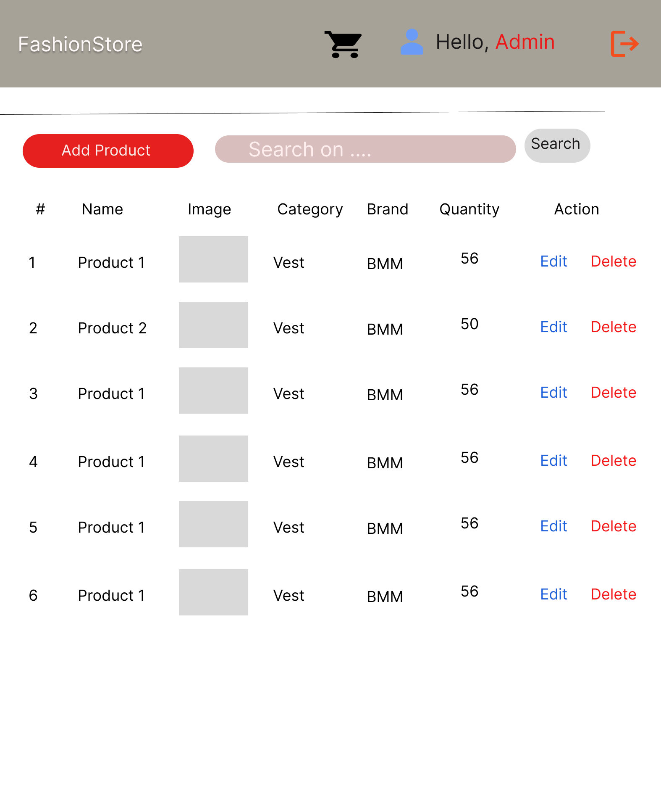

### Add Product Page

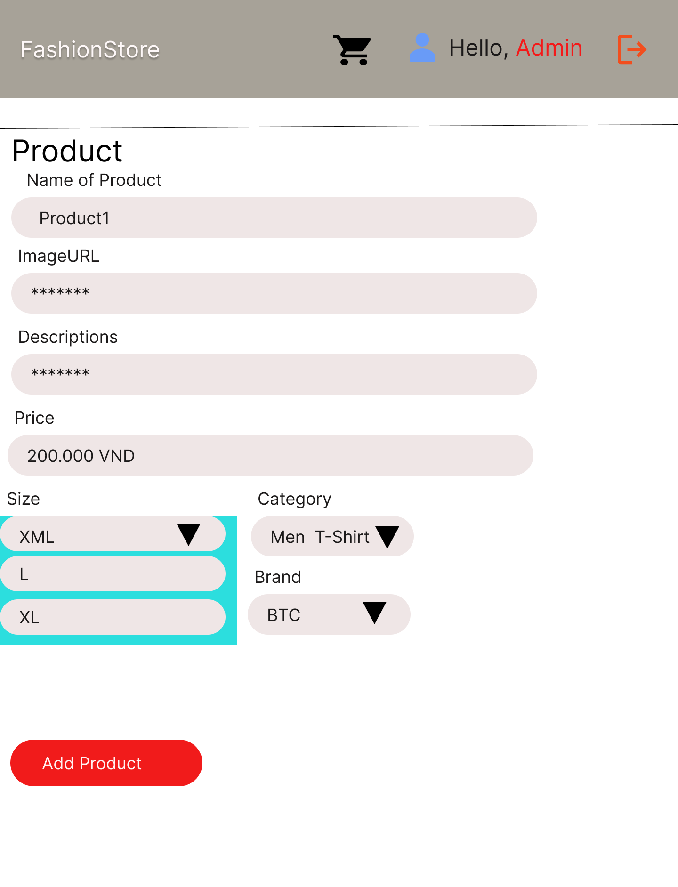

### Edit Page

### OrderHistory Admin Page

.png)

## ERD

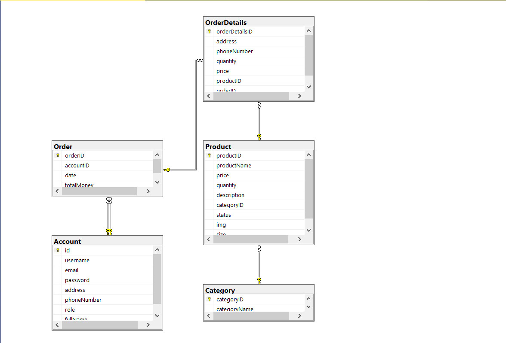

#### *4. Structure of project

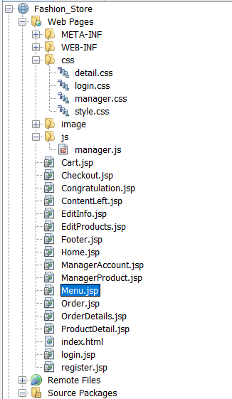

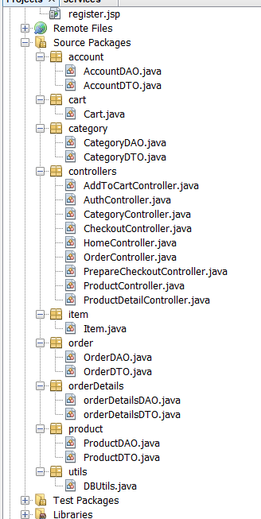

## 5. . Conclusion and Discussion

### + Pros and cons of your application.

#### Pros :
- Easy-to-use display
  
- Manage shopping cart
  
- Shopping cart history
  
- Manage products as an administrator
#### Cons:

- Lack of managed account, order functional

- No payment, voucher functional
  
- Can't do advanced functions like Login with Google or Facebook
  
- Haven't verified by OTP message when creating an account
  
- Haven't done the forgot password function for users

####  Things our team learned during our app development.
- Learn more about MVC2
  
- Learn to use JSTL tags to write programs faster
  
- Learn how to decentralize the app
  
- Learn how to work as a team through GitHub
#### Our team will improve things in our app in the future:

- Add security features like OTP, and verification via Gmail
  
- Add payment features, vouchers
  
- Making apps for mobile apps

